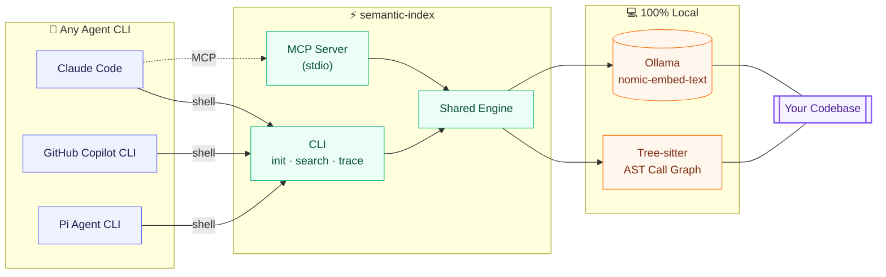

# 🧭 Semantic Review CLI + Local MCP

**Agent-agnostic semantic code search.** Local embeddings for *"find code by meaning"*, AST-based call-graph tracing for *"who calls what"* — one engine, two surfaces: a CLI any agent can shell out to, and an MCP server for agents with native tool support.

## How it works



## Quickstart

```bash
npm install && npm run build
ollama pull nomic-embed-text

semantic-index init                              # index this project
semantic-index search "who validates a login"    # search by meaning
semantic-index trace callers login               # who calls login()?
semantic-index agent-setup --with-subagent       # wire up CLAUDE.md / AGENTS.md / Copilot
semantic-index mcp                               # or run as an MCP server
```

## Why

Modeled on [grepai](https://github.com/yoanbernabeu/grepai) — same idea, one deliberate upgrade: `trace` is **AST-based, not regex**, so it correctly follows arrow functions, `import * as ns` indirection, and class methods a regex tracer misses.

This is a **navigation tool, not a vulnerability detector** — on purpose. Embeddings-search-then-reason is proven weak at cross-file vulnerability detection, so detection logic lives in a separate sibling project instead; here, embeddings only do what they're good at: finding relevant code.

## Status

Proof of concept, **live-tested** against a real local Ollama instance — no mocks. 30 tests passing, including a real MCP subprocess spawned over stdio.

**Known limits:** brute-force cosine search (fine to ~10k chunks, no ANN index yet); call resolution is import/name-based, not full points-to analysis; `nomic-embed-text` is strong at cross-domain search but weaker at distinguishing many similar helpers *within one file* — measured in tests, not hidden. Details in [`docs/ARCHITECTURE.md`](docs/ARCHITECTURE.md).

## License

MIT
