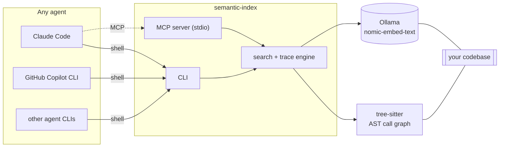

# semantic-index

Semantic code search and call-graph tracing, exposed as a CLI and an MCP server, so any agent can use it — one that shells out (Claude Code, GitHub Copilot CLI, an internal "Pi agent CLI") or one that speaks MCP natively.

- `search "<query>"` — finds code by meaning via local embeddings (Ollama, `nomic-embed-text`), not keyword matching.
- `trace callers|callees <name>` — call-graph lookups via a real tree-sitter AST parse, not regex.

## Architecture



Both surfaces call the same engine code (`src/search/engine.ts`, `src/trace/engine.ts`) — an MCP-native agent and a shell-only agent get identical results.

## Why

**AST tracing, not regex.** Modeled loosely on [grepai](https://github.com/yoanbernabeu/grepai), which traces calls with per-language regex patterns — documented to miss arrow-function handlers. This tool parses with `tree-sitter`/`tree-sitter-typescript` and resolves identifier calls, `import * as ns` indirection, and `this.method()` calls structurally. Calls it can't resolve (dynamic dispatch, `node_modules`, barrel re-exports) go into an explicit `unresolved` list instead of being dropped, so "no callees" and "couldn't resolve" stay distinguishable.

**Search, not detection.** This only finds and ranks relevant code. It does not decide whether code is vulnerable. That's a deliberate boundary, not a missing feature — see `docs/ARCHITECTURE.md`.

## Quickstart

```bash
npm install && npm run build
ollama pull nomic-embed-text

semantic-index init                            # parse + embed + build the call graph for this dir
semantic-index search "who validates a login"  # requires init
semantic-index trace callers login             # does not require init — builds the graph on the fly if needed
semantic-index agent-setup --with-subagent     # writes CLAUDE.md, AGENTS.md, .github/copilot-instructions.md
semantic-index mcp                             # same engine, as an MCP server over stdio
```

## Status

Proof of concept. 54 tests, all passing, no mocks:
- **44 unit tests** — no external dependencies; `npm test` and CI both run exactly this.
- **10 e2e tests** (`npm run test:e2e`) — make real calls to a local Ollama instance and spawn the built CLI as an actual MCP subprocess. One of these tests indexes a sibling repo (`../semantic-code-review`) for an embedding-quality check and is skipped with a clear message if that repo isn't checked out next to this one.

## Known limits

- **No vector index** — still a brute-force scan of every stored chunk, no ANN structure. Embeddings are normalized to unit length at index-build time so each query does one dot product per chunk instead of full cosine math; untested at large scale.
- **Name/import-based call resolution, not points-to analysis** — dynamic dispatch, higher-order calls, and barrel re-exports land in `unresolved` rather than being resolved (never silently dropped).
- **Weaker same-file ranking** — `nomic-embed-text` cleanly separates unrelated domains (>0.5 score) but is measurably worse at ranking one helper among many similar ones in the same file. Search blends in a small function-name/query word-overlap boost to help (see `src/search/lexical.ts`) — a nudge, not a fix; the underlying model limitation is unchanged. See `tests/e2e/search.e2e.test.ts`.
- **No daemon** — `watch` re-parses the whole directory per change (re-embeds only what changed) and stops indexing when the process exits.

Full design rationale, including two real bugs found and fixed while validating this against ground-truth fixtures (anonymous functions invisible as callers; double-counted calls across nested callbacks), is in [`docs/ARCHITECTURE.md`](docs/ARCHITECTURE.md).

## License

MIT
