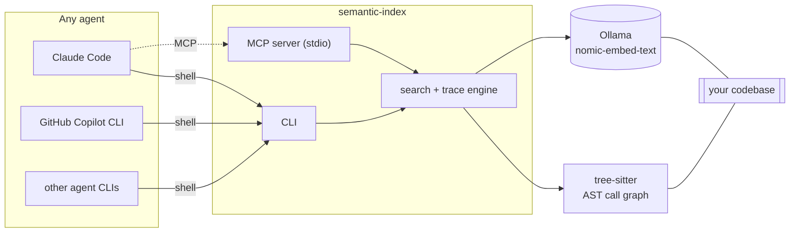

# semantic-index

Semantic code search and call-graph tracing, exposed as a CLI and an MCP server, so any agent can use it — one that shells out (Claude Code, GitHub Copilot CLI, an internal "Pi agent CLI") or one that speaks MCP natively.

- `search "<query>"` — finds code by meaning via local embeddings (Ollama, `nomic-embed-text`), not keyword matching.
- `trace callers|callees <name>` — call-graph lookups via a real tree-sitter AST parse, not regex.

## Architecture



Both surfaces call the same engine code (`src/search/engine.ts`, `src/trace/engine.ts`) — an MCP-native agent and a shell-only agent get identical results.

## Why

**AST tracing, not regex.** Modeled loosely on [grepai](https://github.com/yoanbernabeu/grepai), which traces calls with per-language regex patterns — documented to miss arrow-function handlers. This tool parses with `tree-sitter`/`tree-sitter-typescript` and resolves identifier calls, `import * as ns` indirection, and `this.method()` calls structurally. Calls it can't resolve (dynamic dispatch, `node_modules`, barrel re-exports) go into an explicit `unresolved` list instead of being dropped, so "no callees" and "couldn't resolve" stay distinguishable.

**Search, not detection.** This only finds and ranks relevant code. It does not decide whether code is vulnerable. That's a deliberate boundary, not a missing feature — see `docs/ARCHITECTURE.md`.

## Quickstart

```bash
npm install && npm run build
ollama pull nomic-embed-text

semantic-index init                            # parse + embed + build the call graph for this dir
semantic-index search "who validates a login"  # requires init
semantic-index trace callers login             # does not require init — builds the graph on the fly if needed
semantic-index agent-setup --with-subagent     # writes CLAUDE.md, AGENTS.md, .github/copilot-instructions.md
semantic-index mcp                             # same engine, as an MCP server over stdio
```

## Status

Proof of concept. 30 tests, all passing, no mocks:
- **20 unit tests** — no external dependencies, this is what CI runs.
- **10 e2e tests** — make real calls to a local Ollama instance and spawn the built CLI as an actual MCP subprocess. One of these tests indexes a sibling repo (`../semantic-code-review`) for an embedding-quality check; it will fail if that repo isn't checked out next to this one.

## Known limits

- Brute-force cosine similarity over every stored chunk — no vector index. Fine at the scale this has been tested at; untested at large scale.
- Call resolution is name/import-based, not points-to analysis. Dynamic dispatch, higher-order calls, and barrel re-exports aren't resolved (they land in `unresolved`, not silently dropped).
- `nomic-embed-text` separates unrelated domains well (a basket-vs-address query on real OWASP Juice Shop routes scores >0.5 for the right function) but is measurably weaker at ranking one specific helper among many similar ones in the same file (in one measured case, a targeted query ranked the right function outside the top 10 of 47 candidates). See `tests/e2e/search.e2e.test.ts`.
- `watch` re-parses the whole directory on each change (only re-embeds what changed) — no daemon/service wrapper, and indexing stops when the process exits.

Full design rationale, including two real bugs found and fixed while validating this against ground-truth fixtures (anonymous functions invisible as callers; double-counted calls across nested callbacks), is in [`docs/ARCHITECTURE.md`](docs/ARCHITECTURE.md).

## License

MIT
